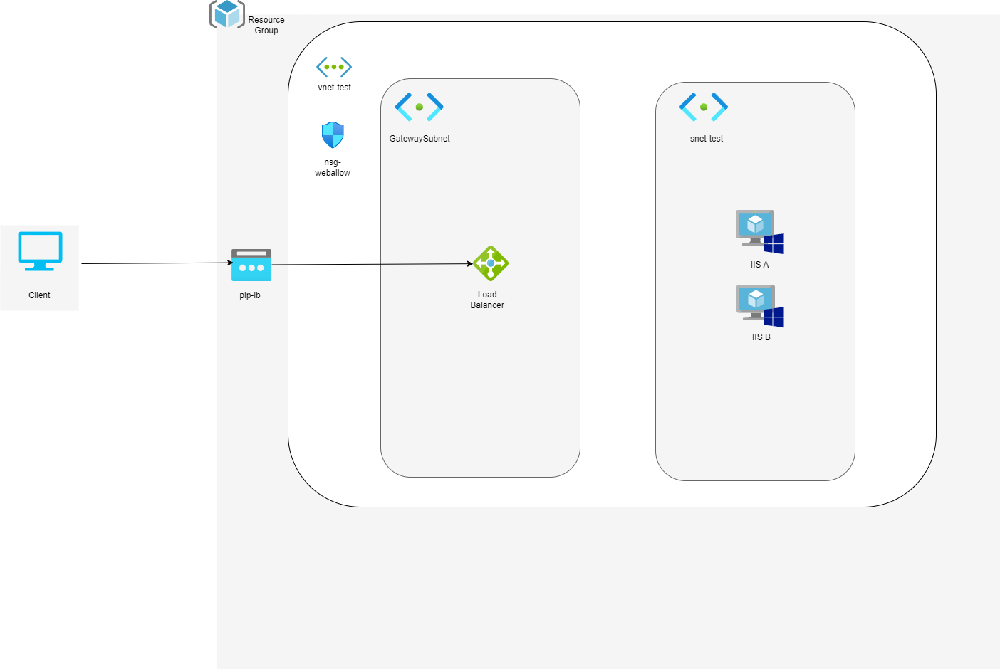

## Terraform Prático - Desafio

Este repositório foi criado com o objetivo de praticar o terraform! Para isso, foram criadas as variáveis `subnet_params` e `network_params` estas devem ser usadas em conjunto com for_each para criar vnet/subnet sem duplicar código.

Este código foi desenvolvido inicialmente pelo [@DarlanCascaes]( https://github.com/DarlanCascaes ) e sedido para realizarmos melhorias.

Aqui estão os vídeos do youtube que foram criados com base no código e que servem de referência!

## Vídeos das revisões do código
[Terraform - Analisando códigos](https://youtu.be/dzhPIcAc0Gc?si=wsOUMSVuZzksMWcB)

[Terraform - Analisando códigos pt2](https://youtu.be/-mOP4vNxxCY?si=1llYOM5qWvjdxlCV)

## Arquitetura

---
Este repositório faz parte da sequência de videos lançados pelo canal [Estação da TI](https://www.youtube.com/@estacaodati)

---